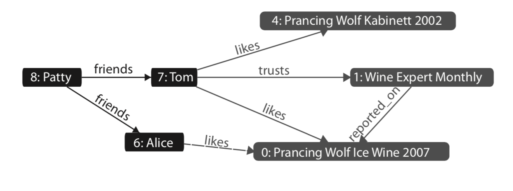

# Neo4J

Today we will  start off with a quiz

## Quiz qustion

CRUD ops with Neo4J

Let's start off with some practice with the material we covered yesterday and
solve the "Do 1" question from Neo 4J - Day 1

Create a simple graph describing some of your closest friends, your
relationships with them, and even some relationships between your friends. Start
with three nodes, including one for yourself, and create five relationships.

## New Material

Now, let's get into new material.  Notes adapted from 7DB - Neo 4J Day1.

From the folder `env/neo4j` start the neo4j container

    docker run -p 7474:7474 -p 7687:7687 \
        -v ${PWD}/data:/data \
        -e NEO4J_AUTH=none \
        adv-db/neo4j

## More queries

Remember, to clean everything up, run:

    MATCH (n)
      OPTIONAL MATCH (n)-[r]-()
      DELETE n, r

First, lets create some data.

    CREATE
        (w0:Wine {name:"Prancing Wolf", style: "Ice Wine", vintage: 2002}),
        (w1:Wine {name:"Prancing Wolf", style: "Kabinett", vintage: 2002}),
        (w2:Wine {name: "Prancing Wolf", style: "Spätlese", vintage: 2010}),

        (wr:Winery {name: "Prancing Wolf Winery"}),
        (wr)-[:produced]->(w0),
        (wr)-[:produced]->(w1),
        (wr)-[:produced]->(w2),

        (p:Publication {name: "Wine Expert Monthly"}),
        (p)-[:reported_on {rating: 97}]->(w0),

        (g:GrapeType {name: "Riesling"}),
        (w0)-[:grape_type]->(g),
        (w1)-[:grape_type]->(g),
        (w2)-[:grape_type]->(g);

Now, let's add a little more.

**Question** Add nodes and relationships to match the figure below:

    MATCH
        (w0:Wine {style: "Ice Wine"}),
        (w1:Wine {style: "Kabinett"}),
        (p:Publication {name: "Wine Expert Monthly"})

    CREATE
        (alice:Person {name:"Alice"}),
        (tom:Person {name:"Tom"}),
        (patty:Person {name: "Patty"}),

        (patty)-[:friends]->(tom),
        (patty)-[:friends]->(alice),

        (tom)-[:likes]->(w1),
        (tom)-[:likes]->(w0),
        (tom)-[:trusts]->(p),

        (alice)-[:likes]->(w0);

## Querying associations

We can follow our associations with `-->` the operator.  For example, to access
all nodes associated with "Tom"

    MATCH (:Person {name: "Tom"})-->(n)
    RETURN n;

Or just the names

    MATCH (:Person {name: "Tom"})-->(n)
    RETURN n.name;

Or every person that is not patty

    MATCH (p:Person)
    WHERE p.name <> 'Patty'
    RETURN p.name;

**Question** what happens if a document doesn't have a name?

    MATCH (:Person {name: "Tom"})-->(n)
  RETURN id(n), n.name, n.x;

Let's add a few more people and make some really interesting queries:

    MATCH
        (alice:Person {name: "Alice"}),
        (tom:Person {name: "Tom"})

    CREATE
        (ahmed:Person {name: "Ahmed"}),
        (kofi:Person {name: "Kofi"}),

        (ahmed)-[:friends]->(alice),
        (kofi)-[r:friends]->(tom);

**Question** Write a query to show only the Person subgraph

    MATCH (p:Person) return p;

Inspect the display, what are the friends of Alice? They are Ahmed and Patty.
Let's write a query for that.

    MATCH (foa:Person)-[:friends]->(a:Person {name: "Alice"})
    RETURN foa.name;

Let's go one further.   What about the friends of friends of Patty?  That is
Patty is friends with Alice and Tom, who are their other friends?  Answer...
Ahmed and Kofi.  Let's write a query!

**Question** Write a query to find the friends of friends of Patty?

    MATCH
       (fof:Person) - [:friends] -> (fap:Person )
       <- [:friends] - (:Person {name: "Patty"})
    RETURN fof.name;

Observe the arrow directions (with no arrows)

    MATCH
       (fof:Person) - [:friends] - (fap:Person )
       - [:friends] - (:Person {name: "Patty"})
    RETURN fof.name;

Changing some arrows:

    MATCH
       (fof:Person) - [:friends] -> (fap:Person )
       - [:friends] -> (:Person {name: "Patty"})
    RETURN fof.name;

**Question** Why are we getting different results?

## Indexes &  Schemas

Similar to relational DBs, we can create an index on a type and property

    CREATE INDEX ON :Wine(name);

And remove:

    DROP INDEX ON :Wine(name);

You can create constraints:

    CREATE CONSTRAINT ON (w:Wine) ASSERT w.name IS UNIQUE;

Which disallows duplicate names:
    CREATE (w:Wine {name: "Daring Goat", style: "Spätlese", vintage: 2008});
    CREATE (w:Wine {name: "Daring Goat", style: "Riesling", vintage: 2006});

And drop constraints:

    DROP CONSTRAINT ON (w:Wine) ASSERT w.name IS UNIQUE;

**NOTE** if you create a constraint, you will get an index.

## Programmatic Access

Next time we will talk about more sophisticated algos and REST access
To make sure you are all setup, from bash run the `curl` command:

     curl http://localhost:7474/db/data/

You should see output like:

    {
        "extensions" : { },
        "node" : "http://localhost:7474/db/data/node",
        "relationship" : "http://localhost:7474/db/data/relationship",
        "node_index" : "http://localhost:7474/db/data/index/node",
        "relationship_index" :
        "http://localhost:7474/db/data/index/relationship",
        "extensions_info" : "http://localhost:7474/db/data/ext",
        "relationship_types" :
        "http://localhost:7474/db/data/relationship/types",
        "batch" : "http://localhost:7474/db/data/batch",
        "cypher" : "http://localhost:7474/db/data/cypher",
        "indexes" :
        "http://localhost:7474/db/data/schema/index",
        "constraints" :
        "http://localhost:7474/db/data/schema/constraint",
        "transaction" :
        "http://localhost:7474/db/data/transaction",
        "node_labels" :
        "http://localhost:7474/db/data/labels",
        "neo4j_version" : "3.5.9"
    }

